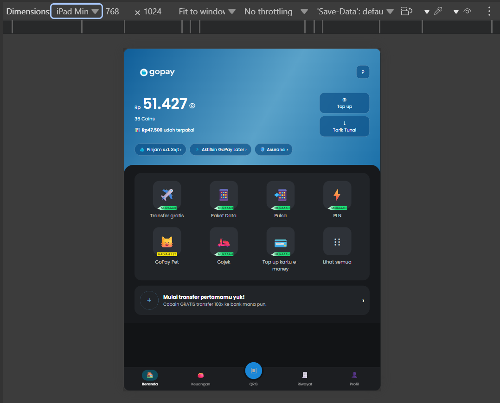
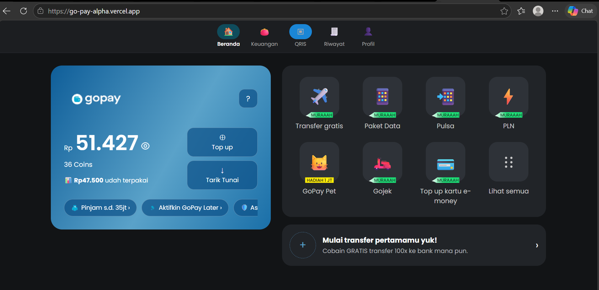

# GoPay Clone - Slicing Website

Tugas slicing tampilan aplikasi GoPay (halaman Beranda), dibuat menggunakan HTML, CSS (Plain CSS, tanpa framework), dan JavaScript (DOM Manipulation).

##  Link

- Repo GitHub: https://github.com/Raifaay/GoPay
- Live Demo: https://go-pay-alpha.vercel.app

## Screenshot

### Tampilan Mobile


### Tampilan Tablet


### Tampilan Desktop


> Sesuaikan ekstensi file (`.png`/`.jpg`) di atas dengan file screenshot asli di folder `assets`.

## Fitur

- Responsive: tampilan menyesuaikan untuk mobile, tablet, dan desktop menggunakan media query.
- Tampil/Sembunyikan Saldo: klik ikon mata untuk menyamarkan saldo (mode privasi).
- Modal Top Up: klik tombol "Top up" untuk membuka modal, pilih nominal, lalu saldo otomatis bertambah setelah konfirmasi.
- Grid Layanan Dinamis: daftar layanan (Transfer, Paket Data, Pulsa, dll) dibuat secara dinamis lewat JavaScript (`createElement`) dari sebuah array data, bukan ditulis manual di HTML.
- Navigasi Aktif: menu navigasi bawah berubah status "aktif" saat diklik.
- Notifikasi Toast: muncul notifikasi kecil di bagian bawah layar setiap kali ada aksi (klik layanan, top up, dsb).

## Teknologi

- HTML5 — struktur halaman
- CSS3 (Plain CSS) — styling & responsive layout (flexbox, grid, media query)
- JavaScript (Vanilla JS) — DOM manipulation & interaktivitas

## Struktur Folder

```
├── assets/         # gambar & icon (logo, badge, screenshot)
├── index.html      # struktur halaman
├── style.css       # styling
├── script.js       # logika & interaktivitas
└── README.md
```

## Cara Menjalankan

1. Clone atau download repo ini
2. Buka file `index.html` langsung di browser, atau jalankan lewat live server
